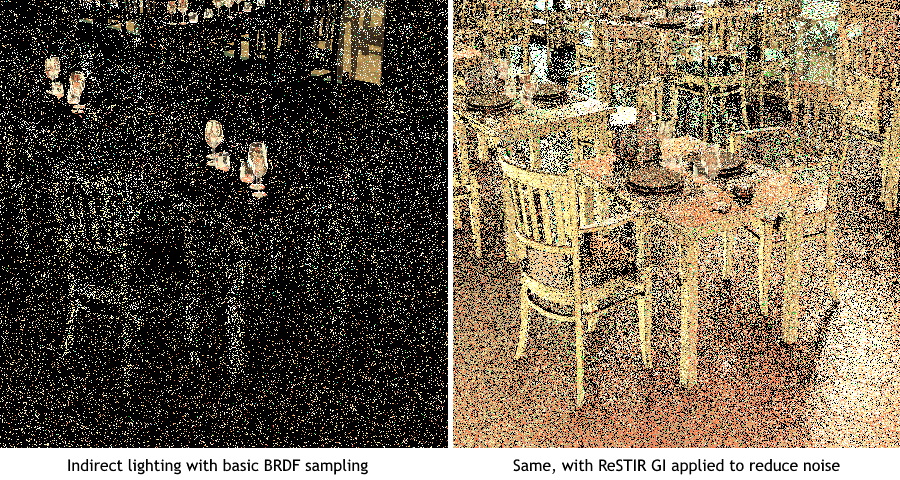

# ReSTIR GI

## What is ReSTIR GI

ReSTIR GI is a spatiotemporal resampling algorithm that is applied to samples of surfaces that produce indirect lighting. For comparison, regular ReSTIR DI operates on samples of lights that affect primary surfaces; ReSTIR GI converts every surface found by tracing BRDF-sampled rays from the primary surface into a light sample.

## Integration model

The RTXDI SDK's implementation of ReSTIR GI follows the same integration model as ReSTIR DI, with the resampling math encapsulated in a number of high-level functions that call various functions in the bridge for application interoperability. The application is expected to call these high-level functions from its own shaders.

The functions and structures necessary for ReSTIR GI implementation are defined in the header files stored in the [`GI/`](../Libraries/Rtxdi/Include/Rtxdi/GI/): See the [API reference](ShaderAPI-RestirGI.md) for more information on the ReSTIR GI functions and structures.

The application needs to implement the various bridge functions necessary for ReSTIR GI in order to compile the shaders. ReSTIR GI and DI share the same bridge interface, and the sets of functions necessary for them intersect. The following shared bridge structures and functions are needed for ReSTIR GI and must be implemented:

	RAB_EmptySurface()
	RAB_GetGBufferSurface(...)
	RAB_GetNextRandom(...)
	RAB_GetSurfaceLinearDepth(...)
	RAB_GetSurfaceNormal(...)
	RAB_GetSurfaceWorldPos(...)
	RAB_IsSurfaceValid(...)
	RAB_RandomSamplerState { ... }
	RAB_Surface { ... }

The following bridge functions are ReSTIR GI specific:

	RAB_GetGISampleTargetPdfForSurface(...)
	RAB_ValidateGISampleWithJacobian(...)
	RAB_GetConservativeVisibility(surface, samplePosition)
	RAB_GetTemporalConservativeVisibility(currentSurface, previousSurface, samplePosition)

ReSTIR GI only needs two GPU resources to operate:

- *Reservoir buffer*: a structured buffer with `RTXDI_PackedGIReservoir` structures. The number of these structures can be calculated using the `rtxdi::ReSTIRGI::getReservoirBufferParameters().reservoirArrayPitch` field, multiplied by the number of frame-sized buffers that you need to implement the desired pipeline (typically 1 or 2).

- *Neighbor offset buffer*: a buffer with offsets used for the spatial and spatiotemporal resampling passes. The same buffer is used for ReSTIR DI, and it can be filled using the `rtxdi::FillNeighborOffsetBuffer(...)` function at creation time.

## Implementation basics

Before an implementation of ReSTIR GI in a renderer can be started, a regular forward path tracer needs to exist. It can be limited in some ways like path length or types of BRDF lobes or effects supported, but it needs to produce three key parameters that are used as ReSTIR GI input: 

- Position and orientation of the secondary surface
- Solid angle PDF of the ray that was used to find the secondary surface
- Reflected and/or emitted radiance of the secondary surface or a path starting from it

Note that the radiance of secondary surfaces is non-directional, which means that ReSTIR GI converts all secondary surfaces into Lambertian reflectors or emitters. It is possible to extend the implementation with some directionality information, such as spherical harmonics or even storing some information about the secondary BRDF and the light(s) used to shade it, but that would make the implementation much more expensive, while the difference will be limited to effects like caustics, and normally ReSTIR GI isn't powerful enough to resolve caustics. For the latter reason, the BRDF of secondary surfaces should be limited to avoid producing sharp caustics, such as by clamping the roughness to higher values.

Once the secondary surfaces or paths have been traced and shaded, the application should create a ReSTIR GI reservoir from it using the `RTXDI_MakeGIReservoir` function. That reservoir can be stored in a reservoir buffer for further resampling, or passed directly into a temporal or a spatiotemporal resampling function. See [ShadeSecondarySurfaces.hlsl](../Samples/FullSample/Shaders/LightingPasses/ShadeSecondarySurfaces.hlsl) for an example.

GI reservoirs created after path tracing can be immediately used for shading, without any resampling. This is a useful mode to verify that the math is correct, that no throughput or visibility term is left behind when ReSTIR GI is inserted into the pipeline. In the basic version (no MIS), the application should take the final GI reservoir for the current pixel and shade the primary surface using that reservoir as a regular emissive surface sample, multiplying the results with `weightSum` from the reservoir. The shading result replaces the original radiance produced by the path tracer. See [FinalShading.hlsl](../Samples/FullSample/Shaders/LightingPasses/GI/FinalShading.hlsl) for an example.

	LightVector = normalize(reservoir.position - primarySurface.position)

	PrimaryReflectedIndirectRadiance = primarySurface.BRDF(LightVector, ViewVector) * reservoir.radiance * reservoir.weightSum

Once the GI reservoir creation and shading are working correctly, resampling passes can be inserted between these two stages. It can be a combination of temporal and spatial passes, or a fused spatiotemporal pass. In the former case, the [temporal pass](../Samples/FullSample/Shaders/LightingPasses/GI/TemporalResampling.hlsl) can be performed in the same shader that does path tracing and/or initial shading, and the [spatial pass](../Samples/FullSample/Shaders/LightingPasses/GI/SpatialResampling.hlsl) can be performed in the same shader that does final shading - or they can be separate shaders, whichever works faster. The sample application uses the separate approach. In the case of fused [spatiotemporal resampling](../Samples/FullSample/Shaders/LightingPasses/GI/FusedResampling.hlsl), all passes can be done in the same shader, which is probably the easiest way to integrate ReSTIR GI into a path tracer, but it's likely not great for performance.

In the final shading pass, multiple importance sampling (MIS) can be applied to recover some image quality lost on shiny surfaces. ReSTIR doesn't work well on specular surfaces with low roughness: the results may look like a more stable, but sparser noise pattern than the original signal, and that's bad for denoising. It's better to combine the ReSTIR GI output with its input in a MIS fashion and use the input signal on surfaces with low roughness. An example of such MIS scheme can be found in the sample application, in the [FinalShading.hlsl](../Samples/FullSample/Shaders/LightingPasses/GI/FinalShading.hlsl) file - see the `GetMISWeight` function and its uses.
